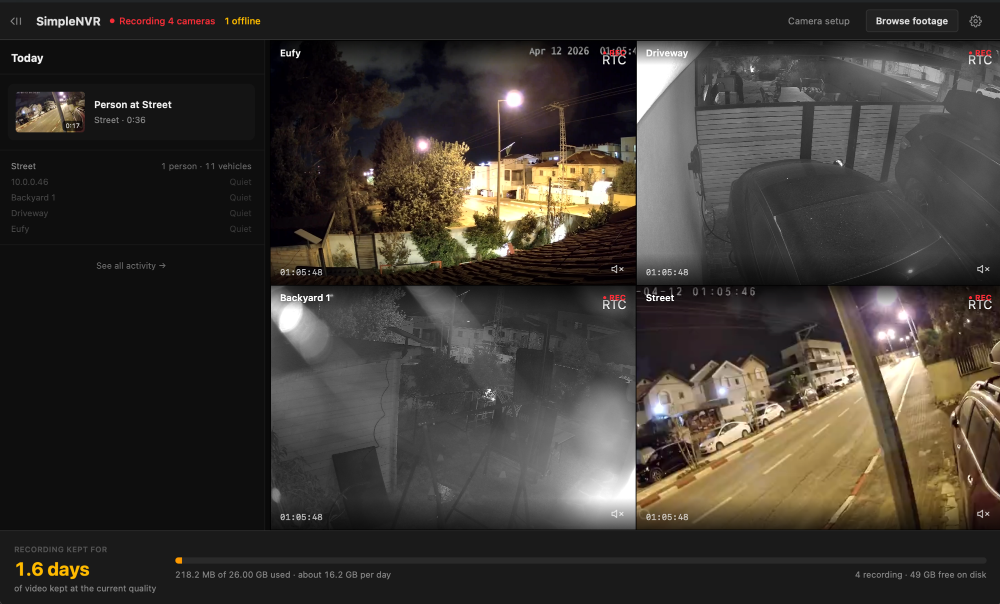

# SimpleNVR

A desktop app that finds the IP cameras on your network and records them. No accounts, no cloud, no subscriptions. Install it, give it your camera passwords, watch it work.



---

## Download

| Platform | Link |
|---|---|
| Windows 11 | [simplenvr-windows.zip](https://github.com/ben-ic/simplenvr/releases/download/v0.1.0/simplenvr-windows.zip) |
| macOS — Apple Silicon | [simplenvr-macos.zip](https://github.com/ben-ic/simplenvr/releases/download/v0.1.0/simplenvr-macos.zip) |
| Linux (`.AppImage`) | [simplenvr-linux.zip](https://github.com/ben-ic/simplenvr/releases/download/v0.1.0/simplenvr-linux.zip) |

*Intel Macs aren't supported by the current build — see [`docs/install.md`](docs/install.md) for details and how to check which chip your Mac has.*

> **Heads up — these builds are not yet code-signed or notarized.** Code signing is on the roadmap before the first public release. Until then, Windows and macOS will warn you on first launch because the app is from an "unidentified developer." That warning is the OS's default treatment of any unsigned binary; it does **not** indicate a problem with SimpleNVR. The instructions below walk you through the one-time bypass each OS requires.

If you'd rather skip the downloads and build from source, see **Building from source** further down.

---

## Installing the downloaded file

Because the current builds are not yet signed, Windows and macOS will warn you on first launch. That warning is the OS's default treatment of any unsigned binary, not a problem with SimpleNVR.

**See [`docs/install.md`](docs/install.md)** for the one-time bypass each OS requires — Windows SmartScreen "Run anyway," macOS Gatekeeper approval from System Settings (or the one-line `xattr` Terminal shortcut), and the straightforward `.deb` install on Debian-family Linux.

---

## What to expect on first launch

SimpleNVR walks you through a short first-run flow and then gets out of your way:

1. **It scans your network** and shows you every camera it can see, identified by brand where possible.
2. **It asks for your camera usernames and passwords.** We show you the factory defaults for common brands as a starting point. If your network has four Reolinks and the username is `admin` on all of them, you type it once.
3. **It starts recording.** As soon as a camera is authenticated, it starts writing video to disk immediately — you don't need to click a "begin recording" button.

After that, the home screen is a live grid of your cameras with a timeline of the day's motion events. There's nothing else to configure. SimpleNVR manages storage on its own — set a disk budget in Settings and it keeps a rolling buffer of footage up to that size. 30 days. 60 days. Whatever fits.

If a camera goes offline, a network blip reconnects automatically, ffmpeg crashes for any reason — SimpleNVR recovers silently in the background. You only see a notification when something actually needs you.

---

## What it does

- **Records 24/7** from any camera that speaks RTSP. Reolink, Amcrest, Annke, Eufy (with HomeBase), TP-Link Tapo, UniFi, and most generic ONVIF cameras are supported out of the box.
- **Detects motion** on every camera using OpenCV background subtraction, with multi-object tracking so one person walking across the yard is one event, not twenty.
- **Identifies people, vehicles, and animals** on-device using a small bundled AI model. No cloud, no subscription, no data leaving your machine.
- **Listens for sounds that matter** (glass breaking, alarms, dogs barking) on cameras that have microphones.
- **Plays back any moment** with a day-scrubber across all cameras. Click a time, see what was happening.
- **Works for up to 32 cameras** on a normal laptop or desktop. Beyond that you want something different — and we'll be honest and tell you so.

Everything runs locally. SimpleNVR does not send your video anywhere, does not require an account, and does not talk to any servers we run.

---

## Supported platforms

- **Windows 11 on ARM64** (Snapdragon X Elite, Copilot+ PCs) — primary deployment target
- **macOS** on Apple Silicon (M1 and newer) — first-class support
- **Windows 11 on x86_64** (Intel/AMD) — supported
- **macOS Intel** (2016+) — supported
- **Linux x86_64** — best-effort; runs fine, not part of the regular release flow

System requirements:

- Any modern CPU from the last 5 years (4 cores or more recommended)
- 8 GB of RAM for up to 8 cameras, 16 GB for 8–32 cameras
- A dedicated drive (or a folder on a large drive) with enough space for the retention you want — plan for roughly 50 GB per camera per day at full quality, or a lot less if you enable the storage-friendly recording mode

---

## Building from source

SimpleNVR is a [Tauri](https://tauri.app) v2 desktop app with a Rust shell, a Python sidecar, and bundled [ffmpeg](https://ffmpeg.org), [go2rtc](https://github.com/AlexxIT/go2rtc), and libmpv binaries. A release build also needs a self-built LGPL-clean `opencv-python-headless` wheel (the stock PyPI wheel is GPL-contaminated — [`docs/cv2-selfbuild.md`](docs/cv2-selfbuild.md) has the why).

### macOS and Linux

From a fresh clone:

```bash
./scripts/setup.sh --with-cv2   # one-time machine setup  (~45 min first run)
./scripts/dev.sh                # run in dev mode (rebundles Python, hot-reloads frontend)
./scripts/build.sh              # build the shippable installer
```

`setup.sh` checks prereqs (Rust, Node, Python 3.11+, CMake, platform tools) in one pass and tells you what's missing. Full details, including what each step does and when to rerun `--with-cv2`, are in [`docs/build.md`](docs/build.md).

### Windows

Windows has its own two-script pipeline (`setup_windows.ps1` + `build_windows.ps1`) and enough platform-specific setup — winget, MSVC Build Tools, Developer PowerShell for VS 2022, WebView2, Defender exclusions — that it gets its own full runbook: [`docs/build-windows.md`](docs/build-windows.md).

---

## How it all fits together

Four moving pieces:

- **Tauri Rust shell** (`src-tauri/`) — the window, the process supervisor, the installer
- **Python backend** (`backend/`) — camera discovery, recording management, motion detection, object classification, audio classification, HTTP API, WebSocket event bus
- **React + TypeScript frontend** (`frontend/`) — the UI, built with Vite
- **Bundled native binaries** (`src-tauri/binaries/`) — ffmpeg for recording, go2rtc for RTSP fan-out, tether for cross-platform parent-death supervision

---

## Documentation

- [`docs/product.md`](docs/product.md) — who SimpleNVR is for, what we deliberately don't build, and the *"can a non-technical user do this?"* test every feature has to pass
- [`docs/architecture.md`](docs/architecture.md) — the technical architecture: Rust shell, Python sidecar, go2rtc, the recording pipeline, lifecycle invariants, and the load-bearing gotchas you need to know before touching recording or discovery
- [`docs/install.md`](docs/install.md) — installing an unsigned build on Windows, macOS, and Linux
- [`docs/build.md`](docs/build.md) — building from source (macOS and Linux)
- [`docs/build-windows.md`](docs/build-windows.md) — the full Windows build runbook
- [`docs/trademarks.md`](docs/trademarks.md) — the legal basis for showing third-party camera brand names and logos in the UI

---

## Not supported (by design)

SimpleNVR records what's on your network. Cameras that stream exclusively through the manufacturer's cloud — **Ring, Blink, Google Nest, Amazon, stock Wyze, TP-Link Kasa, Arlo without a local hub, Xiaomi** — don't expose a local video feed and therefore can't be recorded by any local NVR. This is a vendor architecture choice, not a SimpleNVR limitation we intend to fix. Keep using the manufacturer's own app for those cameras.

Battery-powered motion-wake cameras work when paired with their local hub (Eufy HomeBase, Reolink Home Hub, Arlo SmartHub), and they appear as "asleep" between wake events rather than as "offline."

---

## Questions and issues

Found a bug or have a question? [github.com/ben-ic/simplenvr/issues](https://github.com/ben-ic/simplenvr/issues)
