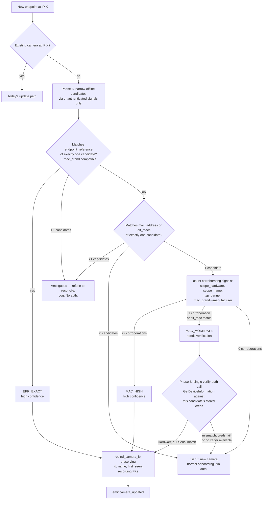

# Tiered camera reconciliation (MAC-fallback for DHCP lease changes)

> **Picking this up cold?** Read this file top-to-bottom, then skim `CLAUDE.md` and `docs/architecture.md`. The load-bearing design decision is in §Architecture: **auth is a verifier, not a matcher.** The scanner never iterates credentials across candidates. If that rule feels wrong, re-read §Architecture before changing it — earlier drafts of this plan got it wrong (see git log for the evolution).

## Context

Today the discovery scanner reconciles cameras by IP only: `ep.ip` → `get_camera_by_ip`. When a camera's DHCP lease rebinds (router reboot, lease expiry, network migration) the old row goes `offline` and a fresh row is minted at the new IP with a new `uuid.uuid4()`. The user's friendly name is lost, recording FKs on the old id become orphans, and the user is re-prompted for credentials they already supplied.

We want identity-based reconciliation: when a new IP appears, try to recognise it as an existing offline camera and re-target that row rather than creating a duplicate.

DHCP reservations on the router are the user-side workaround the NVR industry recommends, but that violates SimpleNVR's zero-config principle — the average target user (mama-and-papa shop) doesn't have credentials to their router, let alone a mental model for static leases. We have to solve this on our side.

## Architecture

### The rule (load-bearing)

> **Credentials are only attempted against a new IP when unauthenticated signals have already identified exactly one candidate with moderate confidence.** The scanner makes **at most one auth call per reconcile event**, and only in the MAC_MODERATE branch. It never iterates credentials across candidates.

This rules out credential-stuffing patterns entirely. A camera whose identity can't be narrowed by unauthenticated signals is treated as new — not brute-force-identified by trying every stored credential against it. Even against our own cameras with our own stored passwords, speculative auth is the wrong pattern (lockout risk, log noise on the camera side, no security posture reason to do it).

### Two-phase flow



### Confidence ladder

| Confidence | Trigger | Reconciles? | Auth calls |
|---|---|---|---|
| `EPR_EXACT` | WS-Discovery EndpointReference exact match + MAC OUI compatible with stored manufacturer | Yes | 0 |
| `MAC_HIGH` | MAC equals `mac_address` + ≥2 corroborating signals | Yes | 0 |
| `MAC_MODERATE` | MAC matches with 1 corroboration, OR alt_mac hit | Yes iff verify-auth succeeds | 1 |
| `NONE` | 0 matches, multiple tied matches, or MAC-only with no corroboration | No — treat as new camera | 0 |

### Online-status guard

Only offline cameras are eligible candidates (`status='offline'`). A camera still answering at its old IP must never be silently retargeted.

### Ambiguity policy

Any tier producing >1 candidate → refuse to reconcile. Silent mis-reconcile (orphaned recordings attached to the wrong camera row) is strictly worse than a stranded offline row — the user can delete a stranded row through Camera Setup; they can't un-mis-attribute recordings.

### ARP cache freshness

`get_arp_table()` is already used in the scanner, and `invalidate_arp_cache()` exists. Call `invalidate_arp_cache()` once at the start of each scan loop iteration where reconciliation is being checked, so we don't act on a 5-minute-stale ARP entry.

## Schema changes

`backend/db.py` — `SCHEMA` gains two columns. Idempotent migrations via `_migrate_add_column`:

```sql
ALTER TABLE cameras ADD COLUMN endpoint_reference TEXT;
ALTER TABLE cameras ADD COLUMN alt_macs TEXT NOT NULL DEFAULT '[]';
```

- `endpoint_reference` — opportunistically populated from WS-Discovery ProbeMatch. Null for cameras discovered via RTSP-only path (Tapo/Eufy).
- `alt_macs` — JSON list of secondary NIC MACs, populated from `GetNetworkInterfaces` whenever we authenticate.

`_row_to_camera` parses `alt_macs` JSON. `upsert_camera` handles both fields — `COALESCE` for `endpoint_reference` (don't wipe on merges) and replace-when-non-empty for `alt_macs` (same pattern as `resolutions`).

## Files to modify

### Schema + model

- `backend/db.py`:
  - `SCHEMA` adds the two columns.
  - `_migrate_add_column` ensures idempotent upgrades.
  - `_row_to_camera` parses `alt_macs`.
  - `upsert_camera` handles both fields.
  - New helper:
    ```python
    async def rebind_camera_ip(conn, camera_id, new_ip, new_xaddr) -> Camera | None
    ```
    UPDATEs `ip`, `xaddr`, `last_seen` WHERE `id=?`. If a different row already owns `new_ip` it's a data-integrity violation (should have been resolved before reconcile got called), so bail with a logged warning and return None.

- `backend/models.py` — add to `Camera`:
  ```python
  endpoint_reference: str | None = None
  alt_macs: list[str] = Field(default_factory=list)
  ```

### Signal capture

- `backend/discovery/ws_discovery.py`:
  - `DiscoveredEndpoint` gains `endpoint_reference: str | None`.
  - `_parse_probe_match` reads `.//a:EndpointReference/a:Address` (the `a:` namespace is already in `NS`) for each `ProbeMatch`.
  - Dedup by EPR in addition to IP in `probe_onvif_devices` — if a camera responds twice (multi-NIC hello) we want the union of its signals.

- `backend/discovery/onvif_client.py`:
  - `CameraInfo` gains `alt_macs: list[str]`.
  - After successful `GetDeviceInformation`, call `GetNetworkInterfaces` to enumerate all NIC MACs:
    ```python
    try:
        ifaces = await devicemgmt.GetNetworkInterfaces()
        info.alt_macs = [
            _normalize_mac(str(iface.Info.HwAddress))
            for iface in (ifaces or [])
            if iface and iface.Info and iface.Info.HwAddress
        ]
    except Exception as e:
        logger.debug("GetNetworkInterfaces failed for %s: %s", ip, e)
    ```
    `GetNetworkInterfaces` is ONVIF Core §8.2.6 and is Profile-S-mandatory; budget cams that don't implement it simply leave `alt_macs` empty and the alt_mac path is unavailable for that camera.

### Reconciliation engine (new)

`backend/discovery/reconcile.py` — pure module, no I/O except the caller-supplied `interrogate_fn`. Full pseudocode below.

### Scanner integration

- `backend/discovery/scanner.py`:
  - Load `offline_candidates` at the top of `run_scan` (once per pass, after `invalidate_arp_cache`):
    ```python
    offline_candidates = [c for c in self._known_cameras.values() if c.status == 'offline']
    ```
  - In the ONVIF branch's `existing is None` path, before the current `get_camera_by_ip`/new-row block, call `reconcile()`. Build `NarrowSignals` from the existing `_identify_endpoint` result + `parse_scopes(ep.scopes)` + `ep.endpoint_reference` + `lookup_manufacturer_by_mac(mac)`.
  - On reconcile hit:
    - `await db.rebind_camera_ip(conn, candidate.id, ep.ip, ep.xaddrs)`
    - Merge fresh fields (hardware_id, serial_number, alt_macs, endpoint_reference, resolutions, rtsp_uri, substream_uri) via a follow-up `upsert_camera` now that the row lives at the new IP.
    - Drop the old IP key from `self._known_cameras` (`self._known_cameras.pop(candidate.ip, None)`), write the reconciled Camera under `ep.ip`.
    - Emit `camera_updated` (NOT `camera_found` — the UI already knows this camera).
    - Log `"Reconciled %s → %s via %s (%s)"` including the evidence list.
  - Apply the same reconcile path in the RTSP-only branch with `endpoint_reference=None` and `xaddr=None` — only MAC_HIGH can succeed there, since MAC_MODERATE requires xaddr for verify-auth and EPR_EXACT requires WS-Discovery.

## `backend/discovery/reconcile.py` — pseudocode

```python
from enum import Enum
from dataclasses import dataclass, field
from typing import Awaitable, Callable

class MatchConfidence(Enum):
    EPR_EXACT = "epr_exact"          # reconcile, no auth
    MAC_HIGH = "mac_high"            # reconcile, no auth
    MAC_MODERATE = "mac_moderate"    # reconcile iff verify-auth passes
    NONE = "none"                    # do not reconcile

@dataclass
class NarrowSignals:
    new_ip: str
    xaddr: str | None                  # ONVIF service URL; None on RTSP-only discovery
    endpoint_reference: str | None     # from WS-Discovery ProbeMatch
    mac: str | None                    # from ARP at new_ip
    mac_brand: str | None              # normalized OUI → brand, from mac_lookup
    scope_hardware: str | None         # parsed from ONVIF Scopes
    scope_name: str | None
    rtsp_server_banner: str | None     # from RTSP OPTIONS

@dataclass
class NarrowResult:
    candidate: "Camera | None" = None
    confidence: MatchConfidence = MatchConfidence.NONE
    evidence: list[str] = field(default_factory=list)

def narrow(
    signals: NarrowSignals,
    offline_candidates: list["Camera"],
) -> NarrowResult:
    """Pure function. No I/O. Fully table-testable."""

    # --- EPR match path ---
    if signals.endpoint_reference:
        hits = [c for c in offline_candidates
                if c.endpoint_reference == signals.endpoint_reference
                and _brands_compatible(signals.mac_brand, c.manufacturer)]
        if len(hits) == 1:
            return NarrowResult(hits[0], MatchConfidence.EPR_EXACT, ["endpoint_reference"])
        if len(hits) > 1:
            return NarrowResult()  # ambiguous; refuse

    # --- MAC / alt_mac match path ---
    if signals.mac:
        hits = [c for c in offline_candidates
                if c.mac_address == signals.mac or signals.mac in (c.alt_macs or [])]
        if len(hits) > 1:
            return NarrowResult()  # duplicate MAC; refuse
        if len(hits) == 1:
            candidate = hits[0]
            is_alt = candidate.mac_address != signals.mac
            corroborations = _collect_corroborations(candidate, signals)
            evidence = [("alt_mac" if is_alt else "mac")] + corroborations
            if len(corroborations) >= 2 and not is_alt:
                return NarrowResult(candidate, MatchConfidence.MAC_HIGH, evidence)
            if len(corroborations) >= 1 or is_alt:
                return NarrowResult(candidate, MatchConfidence.MAC_MODERATE, evidence)
            # MAC alone with no corroboration → not enough; fall through to NONE.

    return NarrowResult()


def _collect_corroborations(candidate: "Camera", signals: NarrowSignals) -> list[str]:
    out = []
    if signals.scope_hardware and candidate.model == signals.scope_hardware:
        out.append("scope_hardware")
    if signals.scope_name and candidate.name == signals.scope_name:
        out.append("scope_name")
    if (signals.rtsp_server_banner and candidate.rtsp_server_banner
            and signals.rtsp_server_banner == candidate.rtsp_server_banner):
        out.append("rtsp_banner")
    if (signals.mac_brand and candidate.manufacturer
            and _brands_compatible(signals.mac_brand, candidate.manufacturer)):
        out.append("mac_brand")
    return out


def _brands_compatible(sig_brand: str | None, stored: str | None) -> bool:
    """Unknown on either side = permissive. Known-disagreeing = False."""
    if sig_brand is None or stored is None:
        return True
    return sig_brand.lower() == stored.lower()


async def reconcile(
    signals: NarrowSignals,
    offline_candidates: list["Camera"],
    interrogate_fn: Callable[[str, str, str, str], Awaitable["CameraInfo | None"]],
) -> tuple["Camera", MatchConfidence, list[str]] | None:
    """
    Returns (candidate, confidence, evidence) on success, or None.

    interrogate_fn signature: (ip, xaddr, username, password) -> CameraInfo | None
    Called at most ONCE per reconcile event, only in the MAC_MODERATE branch,
    only against the singleton prime suspect.
    """
    r = narrow(signals, offline_candidates)
    if r.candidate is None:
        return None

    if r.confidence in (MatchConfidence.EPR_EXACT, MatchConfidence.MAC_HIGH):
        return (r.candidate, r.confidence, r.evidence)

    if r.confidence == MatchConfidence.MAC_MODERATE:
        c = r.candidate
        # If we can't verify, we don't reconcile. Downgrade silently to "new camera".
        if not (c.username and c.password and c.hardware_id and signals.xaddr):
            return None

        info = await interrogate_fn(signals.new_ip, signals.xaddr, c.username, c.password)
        if info is None:
            return None  # auth failed or device unreachable
        if info.hardware_id == c.hardware_id and info.serial_number == c.serial_number:
            return (c, r.confidence, r.evidence + ["verify_auth"])
        return None  # wrong camera at this IP (replaced hardware, etc.)

    return None
```

## Tests

`tests/test_reconcile.py` — pure unit tests against `narrow()` and `reconcile()` with a stubbed `interrogate_fn`. The stub records calls so we can assert auth was/wasn't invoked.

| # | Scenario | Expected result | Auth calls |
|---|---|---|---|
| 1 | EPR matches one candidate, mac_brand compatible | reconcile, EPR_EXACT | 0 |
| 2 | EPR matches one candidate, mac_brand disagrees | None | 0 |
| 3 | EPR matches two candidates (UUID collision) | None | 0 |
| 4 | MAC matches one, 2 corroborations | reconcile, MAC_HIGH | 0 |
| 5 | MAC matches one, 1 corroboration, HardwareId matches | reconcile, MAC_MODERATE | 1 |
| 6 | MAC matches one, 1 corroboration, HardwareId differs | None | 1 |
| 7 | MAC matches one, 0 corroborations | None | 0 |
| 8 | MAC matches two (duplicate MAC) | None | 0 |
| 9 | Alt-MAC match, HardwareId matches | reconcile, MAC_MODERATE | 1 |
| 10 | Alt-MAC match, candidate has no stored creds | None | 0 |
| 11 | MAC_MODERATE path, xaddr=None (RTSP-only discovery) | None | 0 |
| 12 | No EPR, no MAC signal | None | 0 |
| 13 | EPR match but offline candidate list is empty | None | 0 |

## Verification

1. `PYTHONPATH=. pytest tests/ -q --ignore=tests/test_classifier_phase25.py --ignore=tests/test_motion_tracker.py` — full suite green (those two have pre-existing stale imports unrelated to this work).
2. Manual rebind on a live LAN: (a) note a camera's id + name, (b) force router to reassign its IP (DHCP lease flush or power-cycle with short lease time), (c) restart backend, (d) observe `Reconciled <old_ip> → <new_ip> via <confidence> (<evidence>)` in the log, (e) confirm the frontend shows the same camera card (same name) at the new IP with no credential re-prompt, (f) confirm recordings playback still works (FK integrity preserved), (g) confirm no flapping between the two recorder generations during the bounce.
3. Negative: factory-reset a camera so its `HardwareId` changes. Restart backend. Confirm the scanner treats it as a new camera (EPR mac_brand check + MAC_MODERATE verify-auth both fail on HardwareId mismatch).
4. Tapo/Eufy path: force a DHCP rebind on the Tapo at `10.0.0.63` and Eufy at `10.0.0.9`. Confirm reconciliation via MAC_HIGH (if scopes/banner corroborate) or graceful fall-through to new-camera (acceptable — these don't respond to WS-Discovery so EPR is unavailable).

## Known limitations (documented, not gaps)

1. **NIC replacement / physical hardware swap** — all unauth signals miss → treated as new camera. User re-onboards. The old record stays offline until manually removed. Intentional: blind credential stuffing to discover the match would violate the rule in §Architecture.
2. **Cross-VLAN** — reconciliation assumes a flat L2 broadcast domain. Cameras moving across VLANs appear as new devices.
3. **Tapo/Eufy lose the EPR path** — they don't respond to WS-Discovery by default. Reconciliation relies on MAC_HIGH (if scopes/banner corroborate) or treats them as new camera. MAC_MODERATE is unreachable in the RTSP-only discovery branch because we lack an xaddr for verify-auth.
4. **Shared-MAC on clone/OEM hardware** — ambiguity policy refuses to reconcile. User may see a stranded offline row + a new-camera row they need to manually merge via Camera Setup. Zero-config auto-merge is impossible without a stronger signal; the user retains final authority via the delete-stranded-row path.

## Out of scope (deliberate)

- mDNS / Bonjour / SSDP as primary discovery protocols — engineering cost outweighs the marginal coverage gain for our target segment.
- Re-discovery on user demand (a "scan now" button) — the periodic scanner already covers this, and adding a button violates "zero knobs" until we have evidence the auto-cadence is too slow.
- Hello/Bye-announcement-driven reactive reconciliation — a v2 feature. Periodic Probe is sufficient for v1 given the 30s cadence.
- Surfacing IP changes in the UI as an event — the camera just stays online. Logging the move in the backend is enough for diagnosis.
- A "manual merge" UI for cameras auto-reconciliation can't resolve — defer until there's evidence it's needed.
- Configurable confidence thresholds — violates zero-config.

## UX touch — `docs/install.md`

Add a short subsection to `docs/install.md` (camera troubleshooting area). Frame it as *what SimpleNVR does for you*, not as homework:

> ### What if my camera's IP changes?
> SimpleNVR notices when a camera moves to a new address on your network and updates itself automatically. You shouldn't have to do anything — but if you ever see "Offline" for a camera that seems fine, opening the SimpleNVR app for a few minutes lets the next discovery scan catch up.

No mention of DHCP, MAC, or router reservations. The user doesn't need to learn networking to use their NVR — that's the whole product thesis.

## Resume prompt for fresh context

Copy/paste into a fresh Claude session to pick up this work:

> **Task: Tiered camera reconciliation (MAC-fallback IP reconciliation) in the discovery scanner.**
>
> Read `/Users/benjamincates/Dev/simplenvr/plans/mac-fallback-ip-change-plan.md` top-to-bottom first. The load-bearing design decision is in §Architecture: **auth is a verifier, not a matcher.** The scanner never iterates credentials across candidates. If that rule feels wrong, re-read §Architecture — earlier drafts got this wrong.
>
> Then read `/Users/benjamincates/Dev/simplenvr/CLAUDE.md` and `/Users/benjamincates/Dev/simplenvr/docs/architecture.md` (discovery section + the "Settings propagation invariant" notes which are load-bearing for the `camera_updated` bounce path).
>
> Implementation order:
>
> 1. Schema + model — `backend/db.py` (`endpoint_reference`, `alt_macs`, `rebind_camera_ip`), `backend/models.py` (two new Camera fields).
> 2. Signal capture — `backend/discovery/ws_discovery.py` (parse EndpointReference, dedup by EPR), `backend/discovery/onvif_client.py` (capture `alt_macs` via `GetNetworkInterfaces`).
> 3. Reconciliation engine — `backend/discovery/reconcile.py` (new module, pure except for caller-supplied `interrogate_fn`). Follow the pseudocode in §`backend/discovery/reconcile.py` — pseudocode.
> 4. Scanner integration — `backend/discovery/scanner.py` builds `NarrowSignals`, calls `reconcile()`, emits `camera_updated` on hit. Applies to both ONVIF and RTSP-only branches, with the documented capability limits in the RTSP-only branch.
> 5. Tests — `tests/test_reconcile.py`, 13 table-driven cases (§Tests).
> 6. Doc touch — `docs/install.md` user-facing note (§UX touch) + `docs/architecture.md` discovery-section paragraph.
>
> **Tests**: `PYTHONPATH=. pytest tests/ -q --ignore=tests/test_classifier_phase25.py --ignore=tests/test_motion_tracker.py`.
>
> **Don't commit** until Ben reviews the diff.
>
> Once shipped, mark this plan doc done in `CLAUDE.md`'s plan-doc index and add a paragraph to `docs/architecture.md`'s discovery section explaining the two-phase reconciliation rule and why auth is gated behind a singleton unauth narrow.
